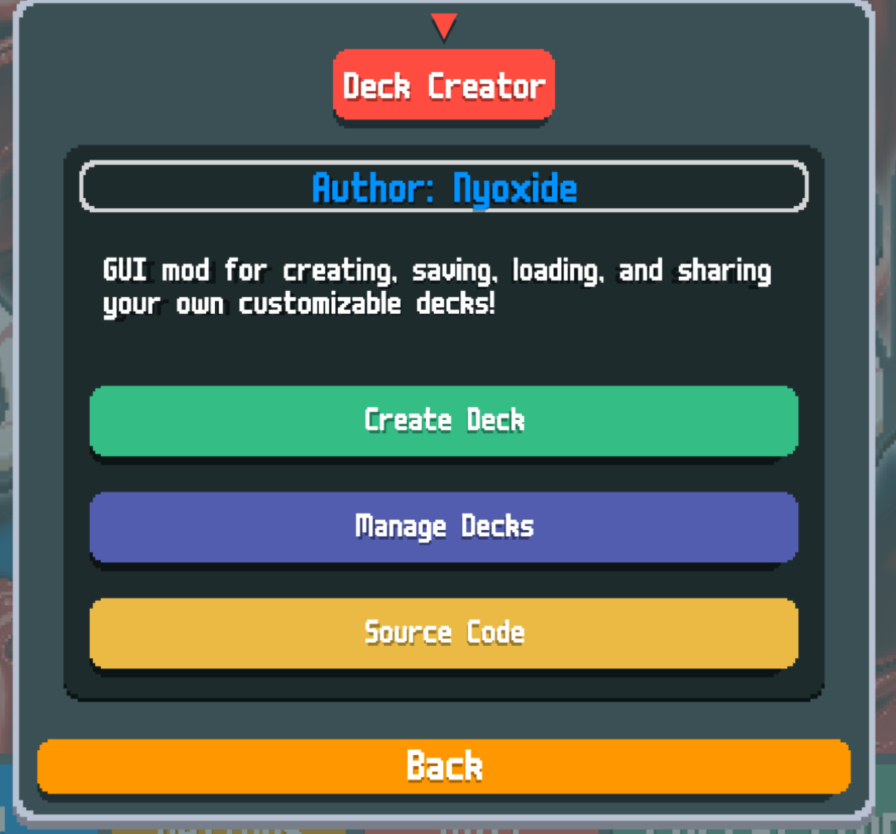
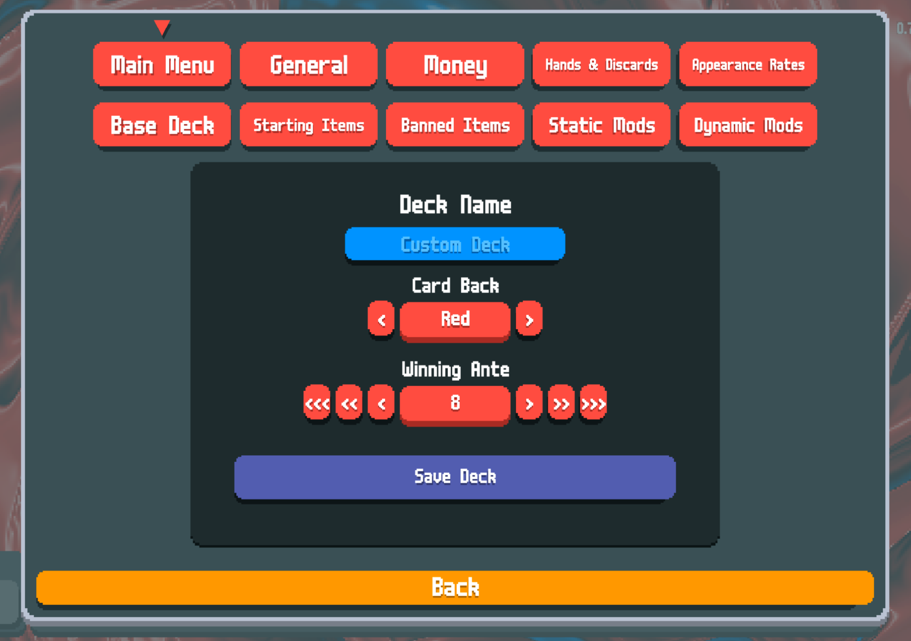
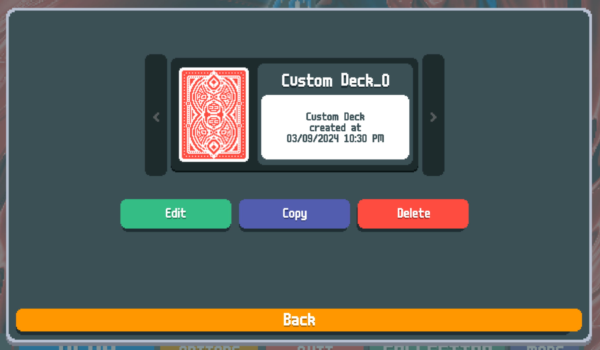
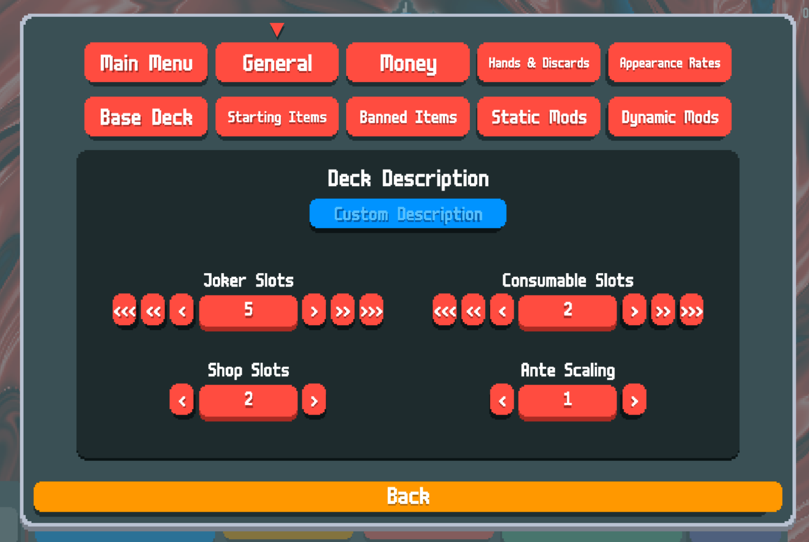
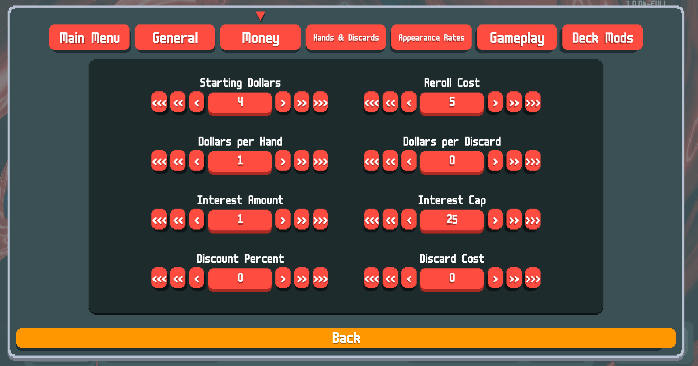
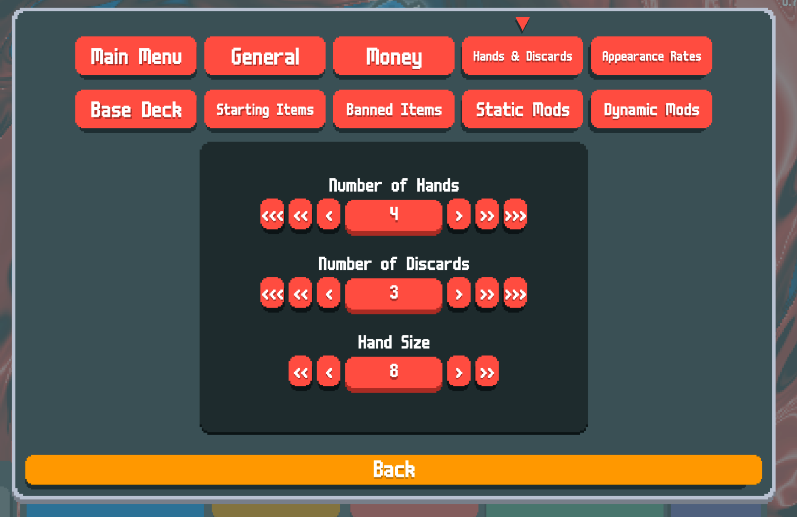
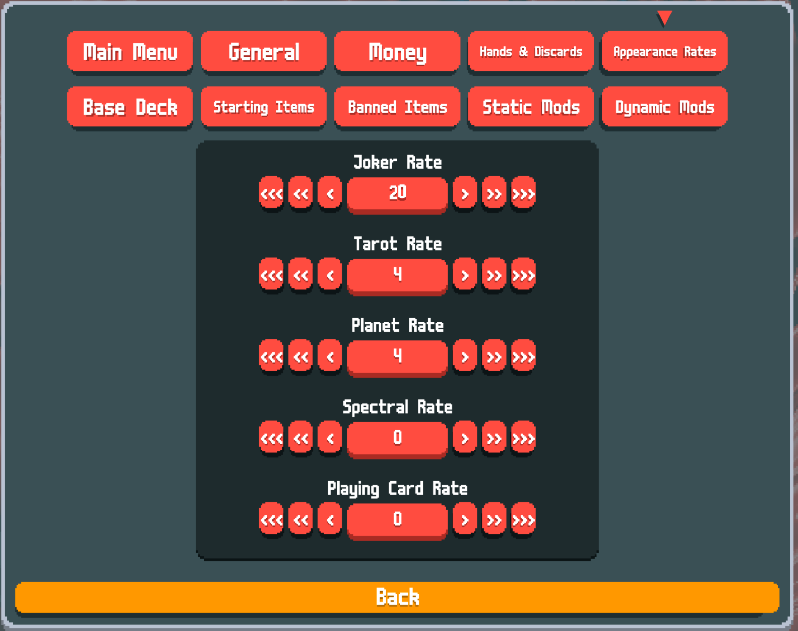
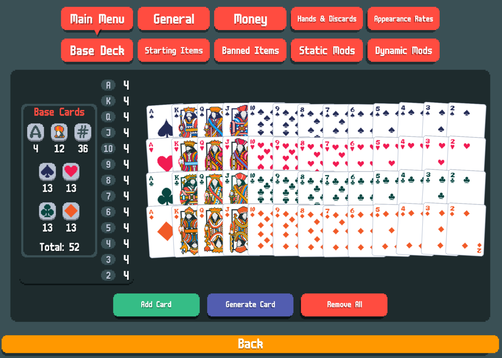
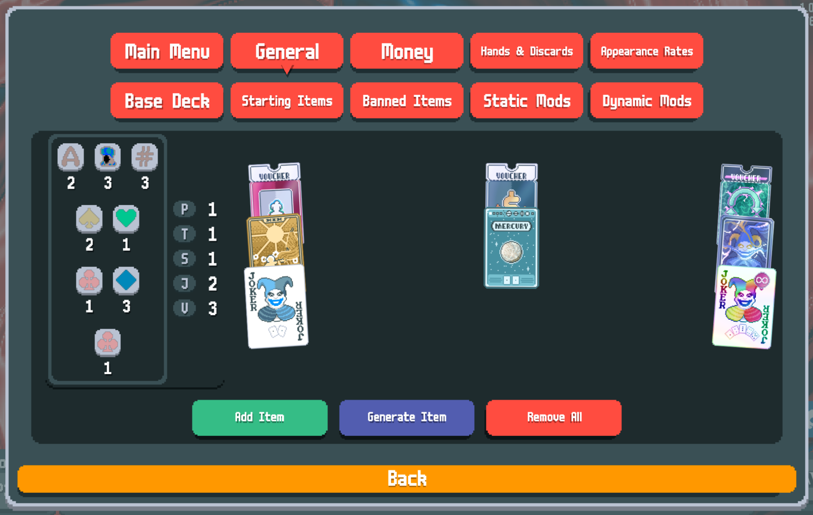
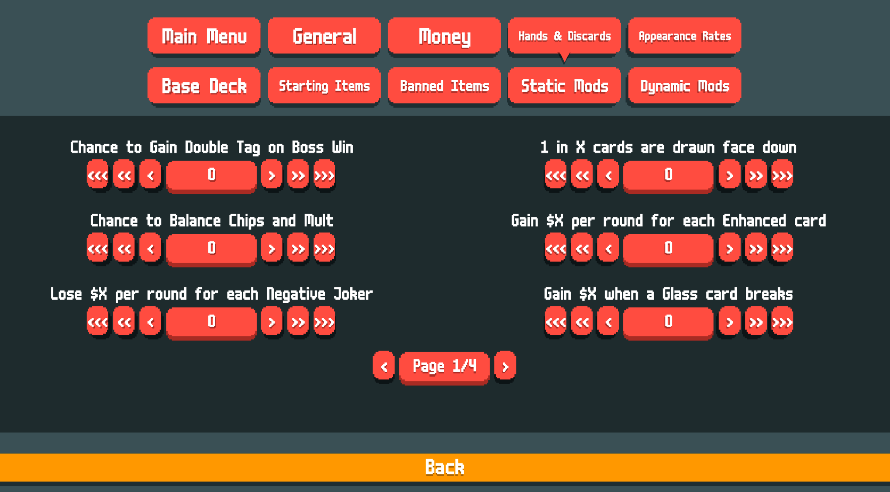

# Deck Creator - Balatro Custom Deck Creation Tool

## Introduction

Deck Creator is a small tool for the game Balatro that allows users to create, save, load, and even share custom decks.

I'm open to suggestions and contributions! Please feel free to create a PR or message me on Discord.

## Requirements

- Balatro 1.0.0c (or newer)
- Steamodded v0.9.8 (or newer)

## How to Install
- Head over to the releases page: [releases](https://github.com/adambennett/Balatro-DeckCreator/releases/latest)
- Download the .zip archive provided
- Extract the contents of the downloaded zip directly into your mods folder
- The result should be a directory at the path: ../Mods/Deck Creator/
- Under this 'Deck Creator' folder you should see a handful of Lua files, an 'assets' directory, and a 'Custom Decks' directory

## How to Use

- Load up modded Balatro (see [Steamodded](https://github.com/Steamopollys/Steamodded))
- Click on the "Mods" button on the main menu
- Click on "Deck Creator" by Nyoxide
- Click on "Create Deck"
- Choose all the options you would like. Options that are not changed will be defaulted to the normal default game options.
- Head back to the "General" tab when you're done, and click "Save Deck"
- The deck will be saved to a file called "CustomDecks.txt" under this mod's folder in another subdirectory. 
- If you would like to share your deck list with anyone, all they need to do is copy and paste your CustomDecks.txt file and place it into the folder in their Mods directory. This mod will detect all .txt files in there and merge all the deck lists together and load all decks into the game.

## Contributing

This project is open for contribution. Please, feel free to open a merge request to do so.

## License

This project is licensed under the GNU General Public License. This ensures that the software is free to use, modify, and distribute. For more details, see the LICENSE file in the repository.

## Screenshots

Create Deck Button    

Main Menu

Manage Decks Menu

General Options

Money Options

Hands & Discards Options

Appearance Rate Options

Deck Editor

Starting Items

Static Mods

Dynamic Mods

